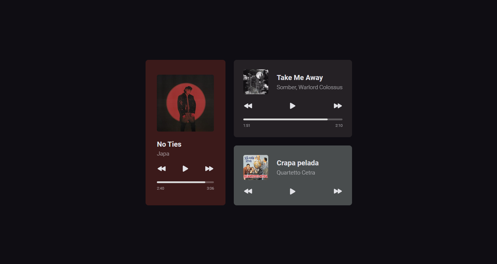

<h1 align="center"> Music Player </h1>

Programa gratuito, promovido pela Rocketseat para ensino de tecnologias WEB.  
<a href="https://www.rocketseat.com.br/boracodar/desafios-anteriores">Veja todos os desafios aqui</a>

  <a href="#-tecnologias">Tecnologias</a>&nbsp;&nbsp;&nbsp;|&nbsp;&nbsp;&nbsp;
  <a href="#-projeto">Projeto</a>&nbsp;&nbsp;&nbsp;|&nbsp;&nbsp;&nbsp;
  <a href="#-layout">Layout</a>

 

  

## 🚀 Tecnologias

Esse projeto foi desenvolvido com as seguintes tecnologias:

- HTML e CSS
- JavaScript
- Git e Github
- Figma

## 💻 Projeto

- [Acesse o projeto finalizado, online](https://matvzn.github.io/MusicPlayer)

## 🔖 Layout

Você pode visualizar o layout do projeto através [Desse Link](https://www.figma.com/community/file/1195050524500542670). É necessário ter conta no [Figma](https://figma.com) para acessá-lo.

## :memo: Licença

Esse projeto não tem nenhum tipo de licença

---

Feito com 💜 by Rocketseat :wave: [Participe da nossa comunidade!](https://discord.gg/rocketseat)
